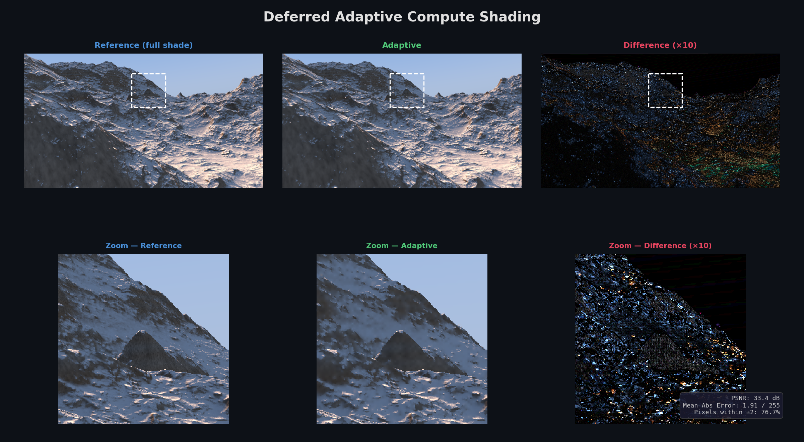
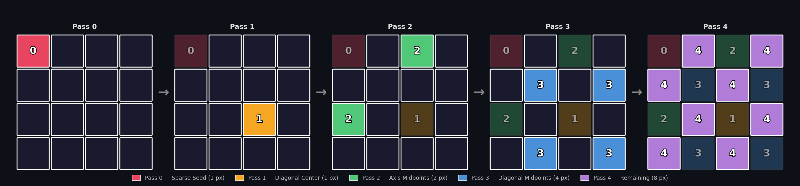
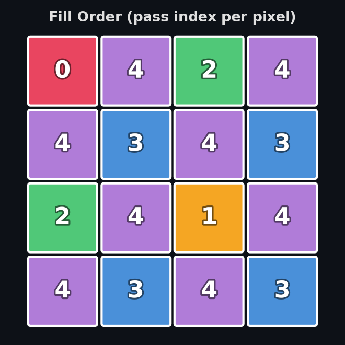
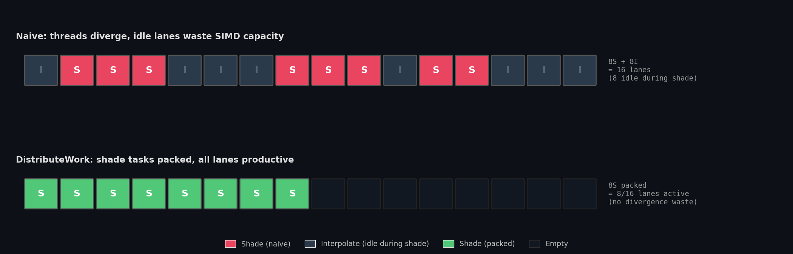
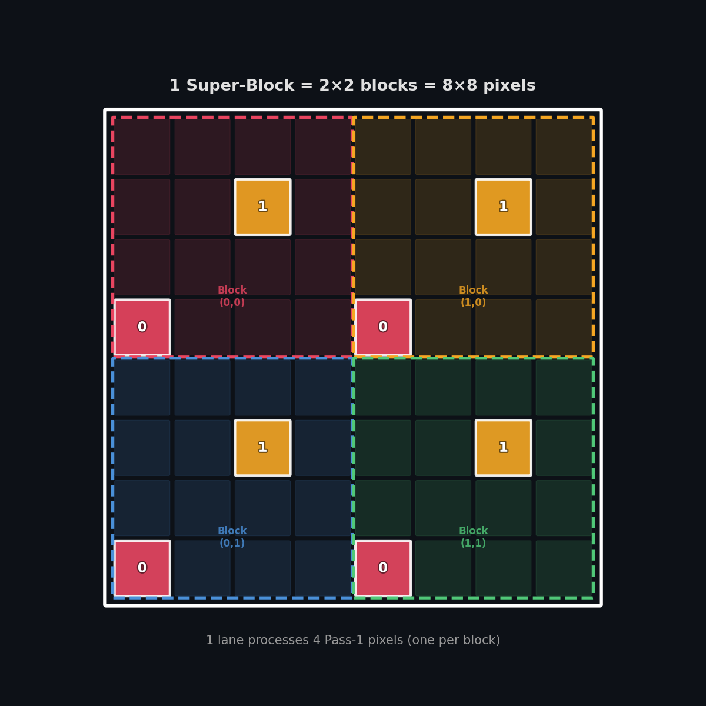

# Adaptive Deferred Shading



An adaptive deferred shading implementation based on the paper [Deferred Adaptive Compute Shading](https://dl.acm.org/doi/10.1145/3231578.3232160), with wave-level work distribution inspired by Brian Karis's [Variable Sized Work](https://graphicrants.blogspot.com/2026/03/variable-sized-work.html). Built with [Slang](https://shader-slang.com/) and [SlangPy](https://shader-slang.com/slangpy/).

## Algorithm Overview

The screen is divided into 4×4 pixel blocks. Instead of shading every pixel, we shade a sparse subset first and then decide for each remaining pixel whether it needs full shading or can be cheaply interpolated from already-computed neighbors.

### Pass Progression

Five passes progressively fill in all 16 pixels of each 4×4 block. Each new pixel sits at the center of 4 already-computed neighbors, enabling the shade-or-interpolate decision.



| Pass | Pixels/block | Pixel positions | Neighbor offsets |
|------|-------------|-----------------|------------------|
| 0 | 1 | `(0,0)` | — (unconditional shade) |
| 1 | 1 | `(2,2)` | `(±2, ±2)` diagonal corners |
| 2 | 2 | `(0,2)`, `(2,0)` | `(±2, 0)`, `(0, ±2)` axis-aligned |
| 3 | 4 | `(1,1)`, `(1,3)`, `(3,1)`, `(3,3)` | `(±1, ±1)` diagonal |
| 4 | 8 | remaining 8 positions | `(±1, 0)`, `(0, ±1)` axis-aligned |

### Fill Order

Which pass fills which pixel within a 4×4 block:



### Shade-or-Interpolate Decision

For each pixel in passes 1–4, the algorithm reads 4 already-shaded neighbors, converts them to luminance, and computes the variance. If the variance exceeds a threshold (`1e-3`), the pixel is fully shaded; otherwise it is interpolated as the average of its neighbors.

## Wave Optimization — DistributeWork

Passes 1–4 use a **DistributeWork** pattern (from Brian Karis — [Variable sized work](https://graphicrants.blogspot.com/2026/03/variable-sized-work.html)) to improve GPU wave utilization.

The problem: within a wave of 32 threads, some threads need to shade (expensive) and others only interpolate (cheap). Naively, all 32 threads stay active for the duration of the slowest path, wasting SIMD lanes.



The solution: a **producer-consumer** model using groupshared memory and wave intrinsics.

1. **Producer phase** — Each lane evaluates its pixels, determines which need shading, and stores the count. Interpolation is performed immediately.
2. **DistributeWork** — Uses `WavePrefixSum` to compute a compact queue of all shade-work items across the wave, then distributes them evenly so every lane gets work. Producer data (block base position + shade mask) is communicated via groupshared arrays.
3. **Consumer phase** (`RunChild`) — Each lane shades its assigned pixel, looking up the source lane's block position and selecting the correct sub-pixel via `NthSetBit`.

### Super-Block Mapping (Pass 1 & 2)

Pass 1 and Pass 2 originally had only 1–2 pixels per lane, too few for DistributeWork to provide a benefit. To increase the work density, these passes use a **2×2 super-block mapping**: each lane covers a 2×2 group of 4×4 blocks (an 8×8 pixel region), raising the pixels per lane to 4 (pass 1) and 8 (pass 2).



## Project Structure

| File | Description |
|---|---|
| `EntryPoint.py` | Pipeline orchestration using SlangPy |
| `AdaptiveLightingPass.slang` | Core adaptive lighting — 5 passes + DistributeWork |
| `Shading.slang` | Deferred lighting evaluation (`shade()`) |
| `GBufferPass.slang` | G-Buffer generation compute shader |
| `GBuffer.slang` | G-Buffer texture declarations |
| `LightingPass.slang` | Traditional (non-adaptive) deferred lighting reference |
| `Elevated.slang` | Procedural terrain scene (from Shadertoy/Elevated) |
| `Shadertoy.slang` | Shadertoy compatibility utilities |

## Usage

```bash
# Adaptive shading (default)
python EntryPoint.py

# Traditional deferred shading (reference)
python EntryPoint.py -reference
```

Output is saved as `Result.png` (adaptive) or `Reference.png` (reference).

### Requirements

- Python 3.10+
- [SlangPy](https://shader-slang.com/slangpy/)
- NumPy
- imageio
